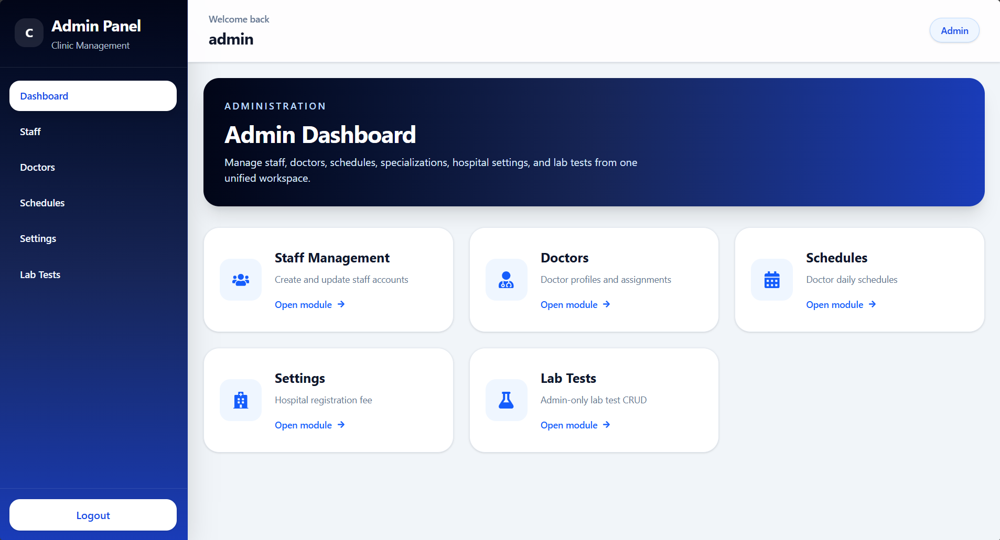

#  Clinic Management System

A full-stack clinic management system built using **Django, Django REST Framework (DRF), React, and MySQL**.  
This application simulates a real-world hospital workflow with role-based access and lab/billing automation.


##  Features

-  Role-based system (Admin, Doctor, Receptionist, Lab Technician)
-  Secure authentication using JWT
-  Lab prescription and report management
-  Automatic abnormal result detection
-  Automated billing system
-  Dashboard with real-time data
-  REST API integration between frontend and backend
-  Responsive UI for smooth user experience


##  Tech Stack

### Frontend
- React (Vite)
- JavaScript
- Tailwind CSS
- Axios

### Backend
- Python
- Django
- Django REST Framework (DRF)
- JWT Authentication

### Database
- MySQL


##  Live Demo

 https://cmsadminlab.vercel.app/


##  Screenshots

###  Dashboards



###  Doctor & Staff


###  Lab Module


###  Billing & Schedule


###  Authentication


##  How to Run Locally

### Backend Setup

```bash
cd backend
pip install -r requirements.txt
python manage.py runserver
```

### Frontend Setup

```bash
cd frontend
npm install
npm run dev
```


##  Project Goal

### This project demonstrates my ability to build a scalable full-stack application with:

- Clean architecture
- Role-based workflows
- Real-world business logic
